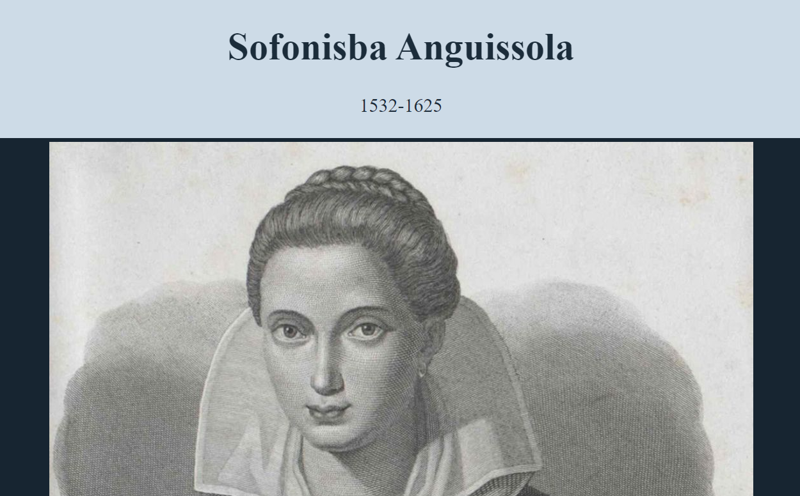

# Tribute Page to Sofonisba Anguissola
  
## Description
I created a simple tribute page to practice making a webpage using HTML and CSS for some practice. This page gives a few facts about the amazing artist, Sofonisba Anguissola of Italy!
[link to form](https://wolaki96.github.io/sofonisba_tribute/)

## Table of Contents

- [Installation](#installation)
- [Credits](#credits)
- [Questions](#questions)
## Installation

Simply go to the page and and read the page for fun! Click on the link in the footer to get a better idea of this amazing artist. 

    

## Credits
Thanks to [freecodecamp](https://www.freecodecamp.org/) for the fun mini practice project! You can make one too by following their easy step-by-step web design course.

## Questions

Please reach out to me on my [GitHub](github.com/wolaki96) or my email at wolaki96@gmail.com if you have any questions!

